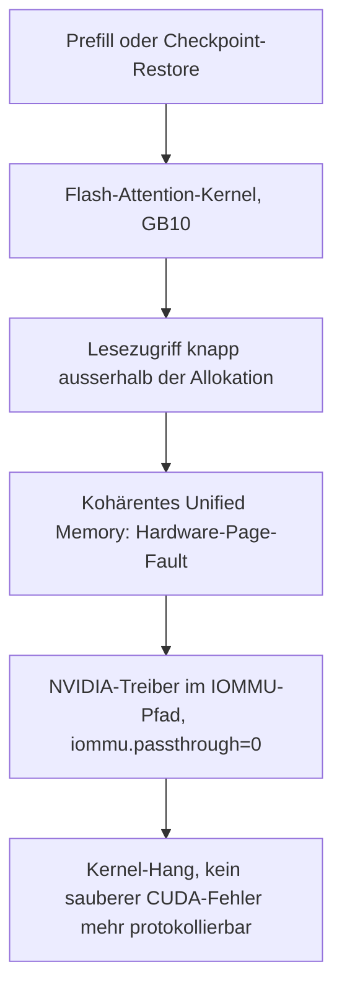

# GX10-Freezes im August 2026: Ursache und Behebung

Sechs harte Freezes zwischen dem 24. und dem 29. August 2026. Dieses Dokument hält
fest, was die Ursache ist und — mindestens so wichtig — welche Hypothesen widerlegt
sind, damit nicht ein weiteres Mal am Modell geschraubt wird. Die Umsetzung liegt in
[ops/gx10/](../ops/gx10/README.md).

> **Ursache:** `OLLAMA_FLASH_ATTENTION=1`. Der Flash-Attention-Kernel liest auf dem
> GB10 gelegentlich knapp über die Allokation hinaus; im kohärenten Unified Memory
> wird daraus ein Hardware-Page-Fault, der die ganze Maschine mitnimmt.
> **Behebung:** eine Zeile, ohne Funktionsverlust.
>
> Zwei frühere Deutungen dieses Dokuments waren falsch: erst `q8_0` als thermische
> Dauerlast, dann die Temperatur als Auslöser. Beide sind unten mit Daten widerlegt.

## Die Ereignisse

| Ereignis | Zustand beim Abriss | Modelle im Boot |
|---|---|---|
| 24.08. 00:46 | mitten in einer Generierung | `qwen3.8:27b-q8_0` (33×), `-bf16`, `qwen3.6` (7×) |
| 24.08. 11:56 | Leerlauf, direkt nach sauber beendeter Anfrage | `qwen3.8:27b-q8_0` (5×) |
| 24.08. 14:27 | E-Mail-Triage, elf Minuten Volllast | `qwen3.8:27b-q8_0` (7×) |
| 26.08. 17:10 | Generierung mit 59 t/s | `qwen3.6` (46×), `qwen3.8:27b` (3×), `q8_0` (2×) |
| 28.08. 15:16 | Volllast | **nur `qwen3.6`** (10×) + Embeddings |
| 29.08. 15:15 | 14 Minuten nach dem Start, 70 Anfragen | **nur `qwen3.6`** (1×) + Embeddings |

Alle sechs waren Hard-Locks: kein `systemd-shutdown` im Journal, keine Panic-Meldung,
in den letzten beiden Boots **null** CUDA-Fehler. Die GPU-Temperatur lag nach dem
Wiederanlauf jeweils deutlich über Leerlauf — die Maschine hatte also Strom und war
trotzdem nicht mehr ansprechbar.

## Die Ursache

Seit dem **21.08. um 01:00** steht in `/etc/systemd/system/ollama.service.d/override.conf`:

```
Environment="OLLAMA_FLASH_ATTENTION=1"
```

Jeder Runner startet seither mit `--flash-attn on`:

```
llama-server --model ... -c 65536 -np 1 --flash-attn on -b 2048 -ub 2048 --context-shift --keep 4
```

Für genau diese Kombination — DGX Spark GB10, aarch64, Ollama 0.32.x, Flash Attention
aktiv — sind zwei Fehlerberichte offen, die das Bild exakt treffen:

- [ollama#17434](https://github.com/ollama/ollama/issues/17434) — «CUDA illegal memory
  access: **qwen3.6** … (0.32.5, DGX Spark GB10 arm64)». Der Melder:
  «`OLLAMA_FLASH_ATTENTION=0` **clears the crash completely**» und «Every abort I
  captured is immediately preceded by that **checkpoint line**.»
- [ollama#17596](https://github.com/ollama/ollama/issues/17596) — derselbe Kernel bei
  grossem Prefill, mit der Erklärung, weshalb es hier die **ganze Maschine** trifft:
  «On standard discrete GPUs, this over-read usually lands within page padding and
  silently succeeds. However, on **Blackwell GB10 coherent unified memory**, strict
  hardware memory protection immediately triggers a hardware page fault.»

Damit schliesst sich die Kette:



Dass in den letzten beiden Freeze-Boots kein einziger CUDA-Fehler im Journal steht,
ist kein Gegenargument, sondern die Bestätigung: Der Page-Fault reisst das System
mit, bevor der Prozess seinen Fehler schreiben kann.

### Warum das jede Beobachtung erklärt

| Beobachtung | Erklärung |
|---|---|
| Vor dem Ollama-Upgrade 10 bis 42 Tage Uptime | 0.24 kannte weder diesen Kernel-Pfad noch Kontext-Checkpoints |
| Modellwechsel `q8_0` → `27b` → `3.6` half nicht | Der Fehler sitzt im Attention-Kernel, nicht im Modell |
| Freeze bei 78 °C, aber 17 Minuten bei 84 °C ohne Freeze | Wärme ist Begleiterscheinung der Last, nicht Auslöser |
| Mal drei Tage stabil, mal 14 Minuten | Der Fehler hängt an der Prompt-Geometrie, nicht an Dauer oder Hitze |
| Immer während Prefill oder Generierung, nie im Leerlauf | Nur dann läuft der betroffene Kernel |
| Am 26.08. Abriss sieben Sekunden nach `created context checkpoint 3 of 32` | deckt sich wörtlich mit ollama#17434 |

Auch die Anfragedichte passt zu einer Wahrscheinlichkeit **je Anfrage**: Der letzte
Boot verarbeitete 70 Chat-Anfragen in 14 Minuten und fror sofort ein, während ein
ruhiger Boot mit 15 Anfragen fast fünf Stunden durchlief.

## Was widerlegt ist

### Nicht die Modellwahl

Die drei letzten Freezes hatten **kein** qwen3.8 im Spiel. Das schrittweise
Herunterfahren von `q8_0` über `27b` auf `3.6` war wirkungslos, weil das Modell nie
die Ursache war. Am 26.08. meldete die letzte Zeile vor dem Abriss 59 t/s — das ist
die MoE-Geschwindigkeit von 3.6, nicht die 7.6 t/s von `q8_0`.

### Nicht die Temperatur

Der Freeze vom 24.08. um 14:27 fiel in den ersten Boot mit Telemetrie und zeigte
einen Anstieg von 76 auf 88 °C mit Drosselung (`0x20`, SW Thermal Slowdown). Daraus
wurde damals die thermische Deutung. Sie hält den weiteren Daten nicht stand:

| Gegenbeobachtung | Wert |
|---|---|
| Freeze am 29.08. | bei **78 °C**, ohne thermische Drosselung |
| Dauerbetrieb ohne Freeze | 17 Minuten bei 84 °C, Spitze 90 °C |

Eine Grösse, die bei 78 °C auslöst und bei 90 °C nicht, ist nicht der Auslöser.
Volllast erzeugt beides zugleich: Wärme und den fehlerhaften Kernel-Aufruf.

### Kein Speicherproblem

`sar` im letzten Messpunkt vor den ersten beiden Freezes:

| Zeitpunkt | verfügbar | belegt | Swap |
|---|---|---|---|
| 24.08. 00:40 | 71.6 GiB | 37.78 % | 6.5 MB |
| 24.08. 11:50 | 66.3 GiB | 41.88 % | 0 |

Über alle Boots: null OOM-Kills, null `Killed process`, keine `NVRM:`- oder
XID-Meldung.

### Kein Lastproblem im Sinne von Dauer

Innerhalb des Boots vom 20.08. bis 24.08.:

| Tag | Chat-Completions | Checkpoint-Restores | Freeze |
|---|---|---|---|
| 21.08. | 196 | 278 | nein |
| 22.08. | 18 | 13 | nein |
| 23.08. | 14 | 10 | nein |
| 24.08. | 4 | 9 | **ja** |

Der lastreichste Tag lief durch, am Crash-Tag genügten vier Läufe. Läufe bis 9m07s
blieben folgenlos. Die Häufigkeit erhöht die Trefferwahrscheinlichkeit, die Dauer
allein nicht.

### Ein Token- oder Kontextlimit hätte nichts geändert

Die letzten Zeilen vor dem Freeze vom 24.08. um 11:56:

```
11:56:33 slot release: id 0 | task 12240 | stop processing: n_tokens = 16965, truncated = 0
11:56:33 srv update_slots: all slots are idle
11:56:33 [GIN] | 200 | 11.845195587s | POST "/v1/chat/completions"
```

Zum Zeitpunkt des Freezes wurde nichts generiert. Ein `max_tokens`-Deckel, ein
kleineres `num_ctx` oder abgeschaltetes Thinking hätten hier nicht gegriffen.

### Ein cgroup-Speicherlimit greift nicht

Naheliegend wäre `MemoryMax=` auf `ollama.service`, um einen Ausreisser den Dienst
statt die Maschine treffen zu lassen. Bei geladenem 24-GB-Modell meldet die cgroup:

```
MemoryCurrent=3982524416      # 3.71 GiB
anon: 0.77 GiB, file: 2.87 GiB
```

Der Unified Memory des Modells taucht im cgroup-Accounting nicht auf, weil ihn der
NVIDIA-Treiber ausserhalb alloziert. Ein Limit würde entweder nie greifen oder den
Dienst aus einem unbeteiligten Grund treffen. Der in der GB10-Community verbreitete
Rat, die Inferenz in einen Container mit `--memory` zu sperren, zielt auf SGLang und
vLLM, wo der Python-Prozess grosse Mengen Host-RAM alloziert. Auf Ollama ist er nicht
übertragbar.

### Power-Limit und Taktbegrenzung gibt es hier nicht

```
Current Power Limit : N/A      --query-supported-clocks : [N/A]
Max Power Limit     : N/A      fan.speed                : [N/A]
```

`nvidia-smi -pl` und `-lgc` sind auf dem GB10 keine Option, auch wenn Foren sie
empfehlen. Ebenso liefert `--query-gpu=memory.used` ein `[N/A]`, weil Unified Memory
nicht getrennt ausgewiesen wird — Speicherwerte müssen aus `/proc/meminfo` kommen.

## Warum die Selbstheilung nicht griff

Der Hardware-Watchdog war eingerichtet und löste bei keinem der sechs Freezes einen
Neustart aus. Zwei Unterbrechungen der Kette sind nachweisbar:

1. `/etc/modprobe.d/sbsa_gwdt.conf` setzt `action=1`. Der Watchdog löst beim Timeout
   einen **Kernel-Panic** aus statt eines Resets.
2. `kernel.panic = 0` war die Vorgabe. Ein Panic bleibt damit **stehen**, statt neu
   zu starten.

Die Kette endete also planmässig im Stillstand. Ob die zweite Stufe des
SBSA-Watchdogs (WS1, Hardware-Reset) auf dieser Plattform überhaupt greifen würde,
ist ungeprüft — das liesse sich nur mit einem absichtlich herbeigeführten Panic
feststellen. Ergänzend fiel auf, dass `wdctl` ein `timeleft` in unplausibler Höhe
meldet; der Wert taugt auf diesem Gerät nicht als Nachweis, dass der Watchdog
tatsächlich herunterzählt.

Beides ist mit `kernel.panic = 10` und `kernel.panic_on_oops = 1` geschlossen
([ops/gx10/panic-reboot.conf](../ops/gx10/panic-reboot.conf)). Das hilft allerdings
nur bei einem Panic. Gegen einen echten Hard-Lock, bei dem der Kernel gar nicht mehr
zum Zug kommt, bleibt allein ein Reset von aussen — deshalb ist die Behebung der
Ursache die eigentliche Massnahme und nicht die Rettungskette.

## Was umgesetzt ist

Alles in [ops/gx10/](../ops/gx10/README.md), installiert mit `sudo ./install.sh`:

1. **`OLLAMA_FLASH_ATTENTION=0`** ([ollama-override.conf](../ops/gx10/ollama-override.conf)) —
   die Behebung. Modelle, Kontextfenster, Vision und Werkzeuge bleiben unverändert;
   der Melder in ollama#17434 hat gegengeprüft: «No regression on the other models
   under FA=0 either.» Flash Attention spart KV-Cache-Speicher, und davon ist bei
   128 GB genug da.
2. **Panic führt zu Neustart** ([panic-reboot.conf](../ops/gx10/panic-reboot.conf)).
3. **Hardware-Watchdog** (SBSA, `/dev/watchdog0`, 120 s) — bleibt eingerichtet,
   nun mit funktionierendem Panic-Pfad dahinter.
4. **Telemetrie im 5-Sekunden-Takt** mit `sync` nach jeder Zeile, weil bei einem
   Hard-Lock der Page-Cache verloren geht und ungepufferte Zeilen genau die
   interessanten wären. Warnung ab 84 °C ins Journal — als Messung, nicht als
   Auslöser.
5. **`sar` im Minutentakt** statt alle zehn Minuten.
6. **[gx10-freeze-report.sh](../ops/gx10/gx10-freeze-report.sh)** zieht nach einem
   Neustart die Schlussminuten zusammen, inklusive rotierter Telemetrie-Dateien und
   des Flash-Attention-Zustands.

## Was ausdrücklich nicht getan wird

- **Keine Modellbeschränkung.** `qwen3.8:27b` und auch `q8_0` sind nicht die Ursache
  und dürfen frei gewählt werden.
- **Keine Temperatur- oder Throttle-Schwelle**, die Last abwirft oder rebootet. Eine
  solche Automatik hätte am 29.08. bei 78 °C nicht ausgelöst und dafür an
  beschwerdefreien Tagen bei 90 °C zugeschlagen.
- **Keine Drosselung von `OLLAMA_NUM_PARALLEL`.** Die Runner starten ohnehin mit
  `-np 1`; die Massnahme wäre wirkungslos.
- **Keine Anlaufbremse für den Hermes-Worker.** Sie hätte die Häufigkeit gesenkt,
  nicht die Ursache berührt.
- **Kein Smart-Plug als erste Massnahme.** Er bleibt in der Hinterhand, falls es nach
  der Behebung erneut auftritt.

Sollte es trotz `FA=0` wieder auftreten, ist der nächste Kandidat `--ctx-checkpoints 0`
([ollama#16744](https://github.com/ollama/ollama/pull/16744)) — als getrennter
Schritt, damit die Wirkung zuordenbar bleibt.

## Nebenbefund: q8_0 ist langsam, aber unschuldig

Bei der thermischen Fehlspur wurde der Durchsatz vermessen. Das Ergebnis bleibt für
die Modellwahl nützlich, auch wenn es nichts mit den Freezes zu tun hat:

| | `qwen3.8:27b-q8_0` | `qwen3.8:27b` | `qwen3.6` |
|---|---|---|---|
| Art | dicht, Q8_0, 29 GB | dicht, Q4_K_M, 18 GB | MoE, ~3 Mrd. aktiv |
| Spekulatives Dekodieren | aus | an, bis 4 Token | — |
| Durchsatz | 7.65 t/s | 33 t/s | ~72 t/s |

Ein dichtes 27-B-Modell liest je Token die vollen Gewichte durch eine Schnittstelle
mit rund 273 GB/s. Dieselbe E-Mail-Triage brauchte im Median **73 s** auf `qwen3.6`
gegen **14 min** auf `qwen3.8`. Deshalb ist `triage_model` / `TP_TRIAGE_MODEL` auf
`ollama/qwen3.6:latest` gesetzt — aus Geschwindigkeitsgründen, nicht aus
Stabilitätsgründen. `qwen3.8:27b` bleibt lokal für die bewusste Auswahl.
